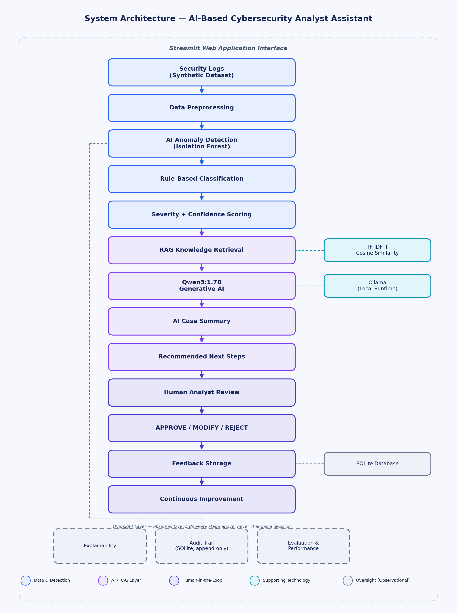
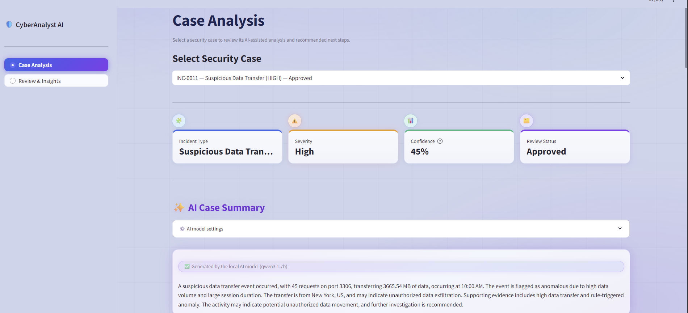
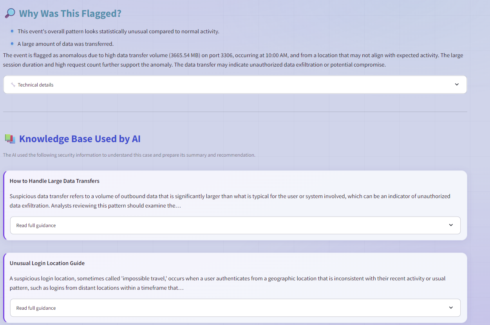
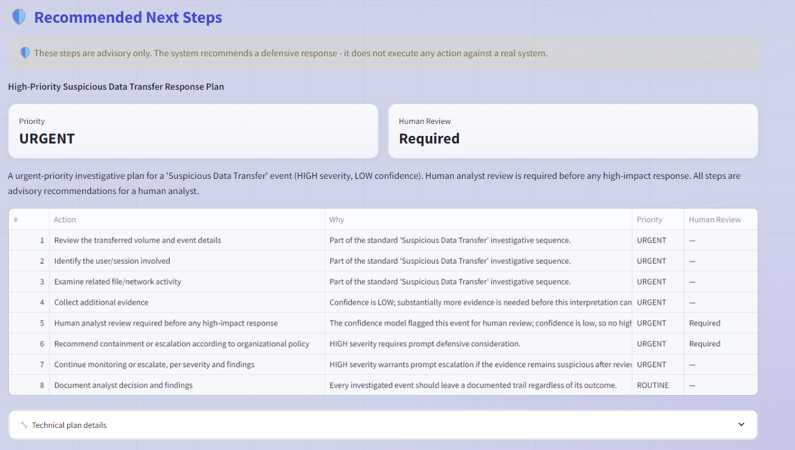
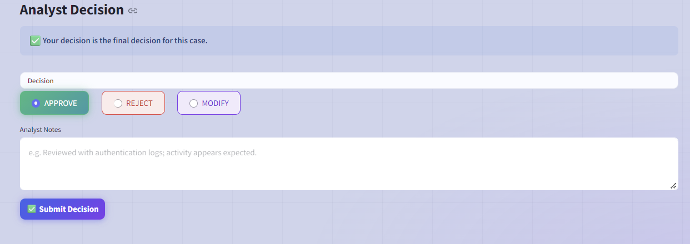
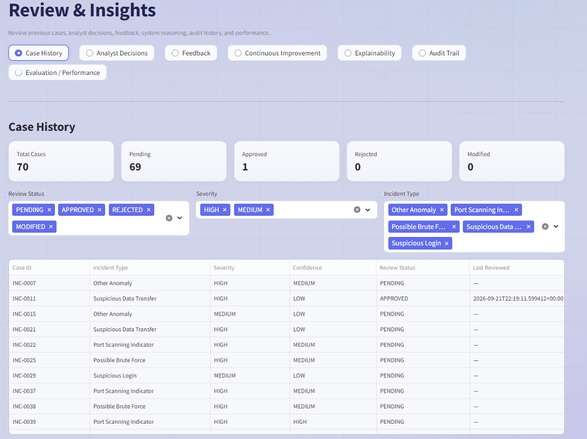
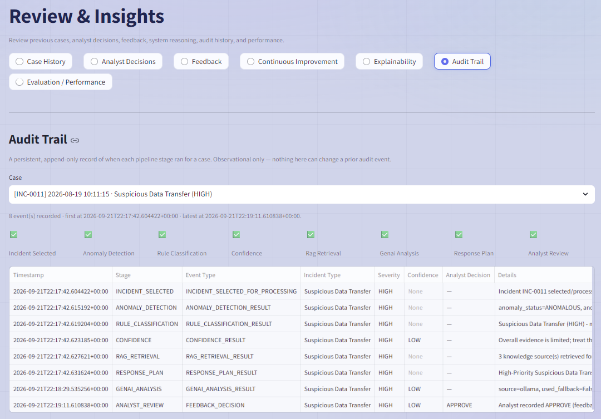

# AI-Based Cybersecurity Analyst Assistant

### Generative AI-Based Cybersecurity Process Reengineering System

A defensive, human-in-the-loop application that helps a security analyst triage security-log events faster by combining unsupervised anomaly detection, an explainable rule engine, confidence scoring, local retrieval-augmented generation (RAG), and a locally-run generative AI model — with every recommendation reviewed and finalized by a human analyst.

---

## 1. Overview

Security teams generate far more log activity than any analyst can manually review, making it time-consuming and inconsistent to judge, by hand, whether an event is anomalous and what to do about it.

This application is a working prototype of an **AI-assisted analyst workstation**. It ingests log records, flags unusual events with machine learning, classifies them with an explainable rule engine, scores its own confidence, retrieves relevant defensive knowledge, and asks a locally-run generative AI model (Qwen3:1.7B) to explain the case in plain English. A suggested — never automatic — response plan follows, reviewed by a human analyst before approval, modification, or rejection.

The analyst is always the final decision-maker. This is a **defensive-only academic prototype**: it does not perform, simulate, or execute any offensive or real-world cybersecurity action.

## 2. Problem Statement

For each event, an analyst needs to judge: is this anomalous, what incident type might it be, how severe, how confident should we be, why was it flagged, what knowledge applies, what should happen next, and who ultimately decides? Doing this consistently by hand is difficult. This project explores how AI can answer the first questions quickly and transparently, while leaving the final decision to a human.

## 3. Proposed Solution

The system implements the following pipeline:

```
Security Logs
      ↓
Data Preprocessing
      ↓
AI Anomaly Detection (Isolation Forest)
      ↓
Rule-Based Classification
      ↓
Severity + Confidence
      ↓
RAG Knowledge Retrieval
      ↓
Qwen3:1.7B Generative AI
      ↓
AI Case Summary
      ↓
Recommended Next Steps
      ↓
Human Analyst Review
      ↓
APPROVE / MODIFY / REJECT
      ↓
Feedback Storage
      ↓
Continuous Improvement
```

Raw logs are cleaned into numeric features. An **Isolation Forest** model, trained without labels, flags unusual events, which a **rule engine** classifies with a severity and **confidence score**. A local **knowledge base** grounds a locally-run **Qwen3:1.7B** summary, while a rule-driven planner proposes advisory next steps. A human analyst then chooses **Approve**, **Modify**, or **Reject** — the only binding decision. Nothing here connects to, modifies, or acts on a real network, account, or device.

## 4. Key Features

| Feature | Description |
|---|---|
| Security Log Processing | Loads and summarizes log records. |
| Data Preprocessing | Cleans and engineers features into model-ready form. |
| Isolation Forest Anomaly Detection | Unsupervised ML flags unusual events. |
| Rule-Based Incident Classification | Explainable rules assign an incident type. |
| Severity Assessment | Deterministic level from which rules fired. |
| Confidence / Uncertainty Analysis | A weighted score of evidence strength. |
| RAG Knowledge Retrieval | Retrieves articles via TF-IDF and cosine similarity. |
| Qwen3:1.7B Local Generative AI | Locally-run model, via Ollama, for summaries. |
| AI Case Summary | Plain-English explanation grounded in evidence. |
| Recommended Next Steps | Advisory, priority-ordered response plan. |
| Analyst Approval / Modification / Rejection | Analyst submits the final, binding decision. |
| Feedback Storage | Decisions persisted to a local database. |
| Continuous Improvement Analysis | Offline analysis of feedback patterns. |
| Explainability | Explains why each stage decided as it did. |
| Audit Trail | Permanent, append-only record per case. |
| Evaluation & Performance | Offline metrics against labeled ground truth. |

## 5. System Architecture



The Streamlit app is a thin layer over independent modules: a data/detection layer (preprocessing, Isolation Forest), an AI/RAG layer (local TF-IDF retrieval feeding Qwen3:1.7B via Ollama), and a human-in-the-loop layer (analyst review, SQLite feedback storage). An oversight layer — explainability, an append-only audit trail, and evaluation — observes every stage without altering a decision.

## 6. How the Application Works

The interface has two main areas: **Case Analysis** and **Review & Insights**.

In **Case Analysis**, the analyst selects a case and sees its type, severity, confidence, and review status at a glance, the **AI Case Summary**, **"Why Was This Flagged?"** evidence, **"Knowledge Base Used by AI,"** and **"Recommended Next Steps"** — then chooses **Approve**, **Modify**, or **Reject**.

**Review & Insights** gives access to case history, past decisions, feedback, continuous-improvement insights, explainability, the audit trail, and offline evaluation metrics.

## 7. Application Screenshots

**1. Case Analysis — Main Interface**


**2. AI Case Summary — Real Qwen3:1.7B Output**


**3. Why Was This Flagged? + Knowledge Base Used by AI**


**4. Recommended Next Steps + Analyst Decision**


**5. Review & Insights — Case History**


**6. Review & Insights — Audit Trail**


## 8. Sample Output

From a real run (case **INC-0011**):

**Detection & classification:** Suspicious Data Transfer · Severity High · Confidence 45% (LOW) — from the rule engine, not the language model.

**AI-generated case summary** (Qwen3:1.7B, via Ollama):
> A suspicious data transfer event occurred, with 45 requests on port 3306, transferring 3665.54 MB of data, occurring at 10:00 AM. The event is flagged as anomalous due to high data volume and large session duration. The transfer is from New York, US, and may indicate unauthorized data exfiltration. Supporting evidence includes high data transfer and rule-triggered anomaly. The activity may indicate potential unauthorized data movement, and further investigation is recommended.

**Retrieved knowledge (RAG):** *How to Handle Large Data Transfers*, *Unusual Login Location Guide*

**Advisory recommendation:** High-Priority Response Plan (Priority: URGENT, Human Review: Required) — review the transfer, identify the user/session, gather evidence, and escalate per policy.

**Human analyst decision:** APPROVE.

## 9. AI and RAG

**Generative AI:** **Qwen3:1.7B**, run locally through **Ollama**, writes an analyst-friendly summary from evidence the pipeline already computed. It never determines incident type, severity, or confidence.

**RAG:** A local knowledge base of 10 JSON documents is searched using **TF-IDF vectorization and cosine similarity** — a lightweight, fully local method, no external service or live internet search — to ground the model's output.

**AI Case Summary** and **Recommended Next Steps** are separate outputs: one explains the case, the other comes from a rule-driven planner.

## 10. Dataset

A synthetic dataset of **350 security-log records** mixes normal activity with crafted suspicious patterns: brute-force attempts, unusual login locations, large data transfers, port scanning, off-hours privilege activity, and multi-device activity.

It includes a `true_label` ground-truth column used **only** for offline evaluation (Section 11) — never supplied to the live detection pipeline.

## 11. Evaluation

**Offline Evaluation on Synthetic Dataset:**

| Metric | Result |
|---|---:|
| Accuracy | 98.00% |
| Precision | 100.00% |
| Recall | 90.91% |
| F1 Score | 95.24% |

These figures describe how well the detector's outputs agree with the synthetic dataset's ground-truth labels — offline, descriptive measurements only, not production-level performance.

## 12. Technology Stack

| Technology | Purpose |
|---|---|
| Python | Core application language |
| Streamlit | Web dashboard / UI |
| Pandas, NumPy | Data loading and feature engineering |
| Scikit-learn | Isolation Forest; TF-IDF + cosine similarity for RAG |
| MiniSom *(optional)* | Optional anomaly-clustering visualization |
| Ollama | Local runtime for the generative AI model |
| Qwen3:1.7B | Local model used for case summaries |
| SQLite | Storage for analyst feedback and the audit trail |

## 13. Installation and Running

**Requirements:** Python 3.12.x, Ollama, and the Qwen3:1.7B model.

```powershell
python -m venv venv
.\venv\Scripts\activate
pip install -r requirements.txt
```

```powershell
ollama pull qwen3:1.7b
```

```powershell
streamlit run app.py
```

The application opens at `http://localhost:8501`. Ollama and Qwen3:1.7B run entirely on the local machine — no cloud API is used. **Model weights are not included in this repository**; `ollama pull` downloads the model locally.

## 14. Project Structure

```
ai_cyber_analyst/
├── app.py
├── config.py
├── requirements.txt
├── README.md
├── data/
├── knowledge_base/
├── screenshots/
├── docs/
└── src/
```

`app.py` is the Streamlit entry point; `config.py` centralizes paths and thresholds; `data/` holds the dataset; `knowledge_base/` holds the RAG documents; `src/` has one module per pipeline stage; `screenshots/` and `docs/` hold this README's images.

## 15. Safety and Scope

This is a **defensive-only, advisory, human-in-the-loop academic prototype**. It does **not** perform automatic account blocking, firewall changes, host isolation, exploitation, or any offensive or automated action. Every recommendation is text for a human to read; the analyst's Approve/Modify/Reject decision is always final.

## 16. Limitations

The dataset is synthetic with fairly distinct patterns, so results do not generalize directly to real-world traffic. Real Qwen3:1.7B summaries require a local Ollama installation; without it, a deterministic fallback is used. This remains an academic prototype, and Section 11's results measure agreement with one labeled dataset — not real-world SOC performance.

## 17. Reference Paper

Sharbaf, Mehrdad S. **"Reengineering Cybersecurity Processes with Generative AI: From Automation to Strategic Alignment."** 5th IEEE International Conference on AI in Cybersecurity (ICAIC), 2026. DOI: [10.1109/ICAIC67076.2026.11395839](https://doi.org/10.1109/ICAIC67076.2026.11395839)

## 18. Student Details

| Field | Details |
|---|---|
| Student Name | Gabriel James |
| Roll Number | 5024128 |
| Department | Information Technology |
| Institute | Fr. Conceicao Rodrigues Institute of Technology (FCRIT), Vashi, Navi Mumbai |
| Academic Year | 2026–27 |
| Subject | Artificial Intelligence |
| CIA / Assignment | CIA-1 |

## 19. Demo Walkthrough

1. Launch the app and open **Case Analysis**.
2. Select a suspicious case and show its type, severity, confidence, and status.
3. Show the real Qwen3:1.7B **AI Case Summary**.
4. Show **"Why Was This Flagged?"** and **"Knowledge Base Used by AI."**
5. Show **"Recommended Next Steps"** and demonstrate Approve / Modify / Reject.
6. Open **Review & Insights** to show case history, feedback, explainability, audit trail, and evaluation.

## 20. Author

Gabriel James
Roll No.: 5024128
